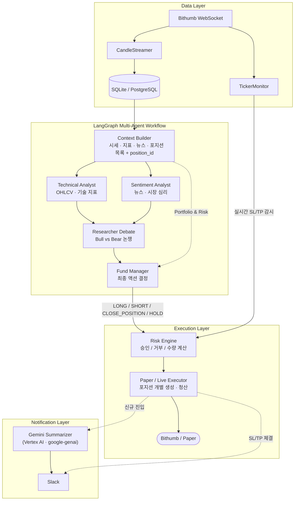

# OpenTrading — LLM 멀티포지션 자동 트레이딩 시스템

LLM 멀티 에이전트가 시장 데이터·기술 지표·뉴스를 종합해 LONG / SHORT / CLOSE_POSITION / HOLD를 결정하고, 리스크 엔진 검증 후 여러 포지션을 동시에 운용하는 자동화 트레이딩 시스템.

---

## 아키텍처



---

## CLI 명령어

```bash
# DB 초기화 (최초 1회)
uv run coin-trading init-db

# 운영 (WebSocket + 스케줄러 통합)
uv run coin-trading serve-all

# 디버그 — 데이터 수집만
uv run coin-trading refresh-data

# 디버그 — LLM 결정 1회
uv run coin-trading decide-once

# 디버그 — 수집 + 결정 1회
uv run coin-trading run-once

# 대시보드
uv run streamlit run src/coin_trading/dashboard.py
```

| 명령어 | 설명 |
|---|---|
| `init-db` | DB 테이블 생성. `--reset` 플래그로 데이터 초기화 가능 |
| `serve-all` | 실시간 WebSocket + 스케줄 결정 루프 + 헬스체크 (운영용) |
| `refresh-data` | 시세·지표 수집만 실행 |
| `decide-once` | 수집 없이 DB 데이터 기반 LLM 결정 1회 |
| `run-once` | refresh-data + decide-once 순서로 1회 실행 |

---

## LLM 결정 기준

### 신규 포지션 진입

| 액션 | 조건 |
|---|---|
| **LONG** | 추세 상승 · RSI 30–65 · 리스크/보상 ≥ 2:1 · 소프트 시그널 1개 이상 |
| **SHORT** | 추세 하락 · RSI 35–70 · 리스크/보상 ≥ 2:1 · 소프트 시그널 1개 이상 |
| **HOLD** | 시그널 불분명 · confidence < 0.50 · 데이터 부족 |

> 소프트 시그널 — 모멘텀(RSI·MACD 방향), 거래량(volume_ratio ≥ 0.40), 논쟁 결과(Bull/Bear WEAK+) 중 하나 이상

### SL/TP 최소 거리 강제 (코드 레벨)

LLM이 좁은 레인지 장에서 너무 타이트한 SL/TP를 설정하지 못하도록 모든 provider에서 자동 보정:

| | 최소값 |
|---|---|
| SL 거리 | `max(1.5 × ATR, entry × 0.3%)` |
| TP 거리 | `max(3.0 × ATR, entry × 0.6%)` |
| Risk/Reward | 2:1 이상 |

### confidence 기반 포지션 비중 조절

| confidence | 최대 투입 비중 |
|---|---|
| < 0.60 | `MAX_POSITION_ALLOCATION_PCT`의 50% 이하 |
| 0.60 – 0.75 | `MAX_POSITION_ALLOCATION_PCT`의 75% 이하 |
| ≥ 0.75 | `MAX_POSITION_ALLOCATION_PCT`까지 |

### 멀티 포지션 관리

- 동시에 여러 LONG / SHORT 포지션 보유 가능
- `CLOSE_POSITION` 액션 — LLM이 `position_id`를 지정하여 특정 포지션만 청산
- `LONG` / `SHORT` 액션 — 기존 포지션을 건드리지 않고 **새 포지션 추가 진입**
- 청산 권고 조건: TP 도달 · 추세 반전 · SL까지 ATR × 0.3 이내 · 8–10h 경과 후 진전 없음

---

## Risk Engine

### 주문 승인 조건

```
신호 수신
    │
    ├─ HOLD? ───────────────────────────────── 주문 없음
    │
    ├─ CLOSE_POSITION? ──── position_id 유효성 확인 → 청산 실행
    │
    └─ LONG / SHORT?
           ├─ leverage > MAX_LEVERAGE          → 거부
           ├─ 포트폴리오 낙폭 > KILL_SWITCH_DRAWDOWN → 거부 (Kill Switch)
           ├─ reentry cooldown 미경과           → 거부
           ├─ confidence < 0.50               → 거부
           └─ 승인 → 수량 계산 후 실행
```

### 수량 계산

```
risk_budget  = current_equity × RISK_PER_TRADE
raw_quantity = risk_budget / |entry_price - stop_loss|

allocation_pct = min(LLM 제안값, MAX_POSITION_ALLOCATION_PCT)
max_notional   = current_equity × allocation_pct × leverage

final_quantity = min(raw_quantity, max_notional / entry_price)
```

### 동적 SL/TP

| 메커니즘 | 동작 | 환경변수 |
|---|---|---|
| **Trailing Stop** | 현재가에서 일정 % 뒤로 SL이 연속적으로 따라감 | `TRAILING_STOP_PCT` |
| **Trailing TP (Comeback)** | 가격이 TP 돌파 시 → 기존 TP를 trigger로 저장 + TP를 더 연장. 가격이 trigger로 복귀 시 청산 | `TRAILING_TP_PCT` |
| **TP 근접 시 SL 조임** | 가격이 TP에서 1.5 × ATR 이내 진입 시 SL을 entry 쪽으로 0.5 × ATR씩 당김 | (자동 작동) |

### 주요 안전 장치

| 항목 | 기본값 | 설명 |
|---|---|---|
| `RISK_PER_TRADE` | 5% | 한 거래에서 손절 시 잃을 최대 자산 비율 |
| `MAX_POSITION_ALLOCATION_PCT` | 20% | 단일 포지션에 투입 가능한 최대 자산 비율 |
| `KILL_SWITCH_DRAWDOWN` | 10% | 총 낙폭이 10% 초과 시 신규 진입 전면 차단 |
| `LIQUIDATION_BUFFER` | 8% | 청산가 8% 이내 접근 시 경고 이벤트 발생 |
| `PRICE_CONSISTENCY_THRESHOLD_PCT` | 0.5% | LLM 결정 중 가격이 0.5% 이상 이탈 시 주문 취소 |
| `TRADING_MODE` | `paper` | 실주문 불가. `live` + `LIVE_TRADING_ENABLED=true` 동시 필요 |

### 실시간 SL/TP 모니터링

WebSocket TickerMonitor가 실시간으로 가격을 수신하여, SL/TP 도달 시 해당 포지션을 즉시 자동 청산 (`emergency_exit`).

---

## 뉴스 수집

CoinDesk Data API (기본값) 또는 RSS 피드에서 뉴스 적재 → Sentiment Analyst가 판단 시 활용.

### CoinDesk (기본)

`https://data-api.coindesk.com/news/v1/article/list` 호출. CoinDesk가 GPT로 사전 분류한 `SENTIMENT` 라벨(`POSITIVE` / `NEUTRAL` / `NEGATIVE`) 그대로 LLM에 전달.

| 필드 | 출처 |
|---|---|
| `title` | TITLE |
| `subtitle` | SUBTITLE (BODY는 노이즈로 제외) |
| `source` | SOURCE_DATA.NAME (CoinDesk, Bitcoin.com 등) |
| `categories` | CATEGORY_DATA.CATEGORY (BTC, MARKET, EXCHANGE 등) |
| `sentiment` | SENTIMENT 라벨 |
| `score` | UPVOTES − DOWNVOTES |
| `published_at` | PUBLISHED_ON (UTC) |

### Incremental Fetch

매 사이클마다 동일 50건을 다시 처리하지 않도록 `AppState.coindesk_last_published_ts`에 high watermark 저장. `PUBLISHED_ON > last_ts`만 INSERT.

### 환경변수

```env
NEWS_SOURCE=coindesk         # coindesk | rss
COINDESK_API_KEY=...
COINDESK_LANG=EN
COINDESK_CATEGORIES=BTC      # 빈 값이면 전체
COINDESK_FETCH_LIMIT=50
```

---

## Observability (Opik)

각 LangGraph 노드의 latency / 입출력 / 토큰 사용량을 [Opik](https://www.comet.com/opik) 대시보드에서 트레이싱.

### 설정

```env
OPIK_API_KEY=...
OPIK_WORKSPACE=your-workspace      # 미설정 시 default
OPIK_PROJECT_NAME=opentrading
```

미설정이면 트레이싱 자동 비활성 (no-op). 거래 흐름에 영향 없음.

### 캡처되는 정보

| Span | 측정 |
|---|---|
| `technical_analyst` | LLM 호출 시간, prompt/response, tokens |
| `sentiment_analyst` | (병렬 실행 — analyst 둘 중 느린 쪽이 bottleneck) |
| `sequential_debate` | Bull → Bear 순차 시간 (가장 큰 latency 원인) |
| `fund_manager` | 최종 JSON 결정 latency |

### 로컬 로그에도 elapsed 출력

Opik 미설정 시에도 stdout / `logs/trading.log`에서 노드별 시간 확인 가능:

```
   <- [Node] Technical Analyst finished in 2.34s.
   <- [Node] Sentiment Analyst finished in 3.11s.
   <- Bull finished in 4.87s
   <- Bear finished in 5.20s
   <- [Node] Debate concluded (bull=4.87s bear=5.20s total=10.07s).
   <- [Node] Fund Manager finished in 6.42s.
```

---

## 알림 시스템

Slack Incoming Webhook으로 모든 알림 발송.

| 채널 | 환경변수 |
|---|---|
| **Slack** | `SLACK_WEBHOOK_URL` |

### 알림 트리거

| 이벤트 | 메시지 종류 |
|---|---|
| 신규 LONG / SHORT 진입 | Gemini 요약 (Vertex AI · `google-genai` SDK) |
| SL / TP 체결 청산 | Plain-text 포맷 (방향, 진입가, 체결가, 실현 PnL) |
| 헬스체크 (08:00 / 15:00 / 21:00) | `[시각] 봇 정상 작동 중` |

> Vertex AI 미설정 시 Gemini 요약 대신 fallback 포맷이 사용됩니다.

---

## 환경변수 (`.env`)

`.env.example` 참고. 주요 항목:

```env
# 트레이딩 모드
TRADING_MODE=paper           # paper | live
EXCHANGE=bithumb_spot
SYMBOL=KRW-BTC
INITIAL_EQUITY=100000000

# 리스크 관리
RISK_PER_TRADE=0.05
MAX_LEVERAGE=1
MAX_POSITION_ALLOCATION_PCT=20
KILL_SWITCH_DRAWDOWN=0.10
TRAILING_TP_PCT=0.005
TRAILING_STOP_PCT=0.003

# LLM
LLM_PROVIDER=nvidia          # nvidia | openai | gemini | openrouter
LLM_MODEL=nvidia/nemotron-3-super-120b-a12b

# 알림
SLACK_WEBHOOK_URL=https://hooks.slack.com/services/...

# Vertex AI (Gemini 요약)
VERTEX_PROJECT_ID=...
VERTEX_MODEL_ID=gemini-2.5-flash
VERTEX_LOCATION=us-central1
GOOGLE_APPLICATION_CREDENTIALS=path/to/service-account.json
```

---

## 운영 (macOS launchd)

`scripts/bot.sh` 한 번에 launchd 등록·시작·정지·로그 확인.

```bash
# 시작 / 정지 / 재시작
./scripts/bot.sh start      # 봇 시작 + 부팅 시 자동 시작 + 죽으면 자동 재시작
./scripts/bot.sh stop       # 정지 + launchd 등록 해제 (실행 끄기)
./scripts/bot.sh restart    # 재시작

# 모니터링
./scripts/bot.sh status     # 살아있는지 + PID + 메모리/CPU
./scripts/bot.sh logs       # 실시간 트레이딩 로그 (Ctrl+C 종료)
./scripts/bot.sh errors     # 에러 로그 (마지막 50줄)
```

- 로그: `logs/trading.log` (매일 자정 자동 분할, 7일치 보관)
- launchd 출력: `logs/launchd.out`, `logs/launchd.err`
- Sleep 방지: Amphetamine 등 별도 앱 사용 권장

---

## 디렉토리 구조

```
src/coin_trading/
├── agent/              # LangGraph 멀티 에이전트 (analyst, researcher, fund manager)
│   ├── nodes/
│   ├── prompts/
│   ├── context.py      # LLM 컨텍스트 구성
│   ├── llm.py          # Provider별 LLM 클라이언트 + SL/TP 보정
│   └── schemas.py      # 결정 스키마
├── db/                 # SQLAlchemy 모델 / 세션
├── market/             # 시세 수집, 지표, 뉴스
│   └── exchange/       # Bithumb REST · WebSocket
├── trade/              # Risk Engine, 포트폴리오, 실행기
│   └── execution/      # paper · live_bithumb
├── notifications/      # Slack · Gemini Summarizer
├── app.py              # CLI 엔트리
├── config.py           # Pydantic Settings
├── dashboard.py        # Streamlit 대시보드
└── scheduler.py        # 통합 파이프라인 / serve-all
```
