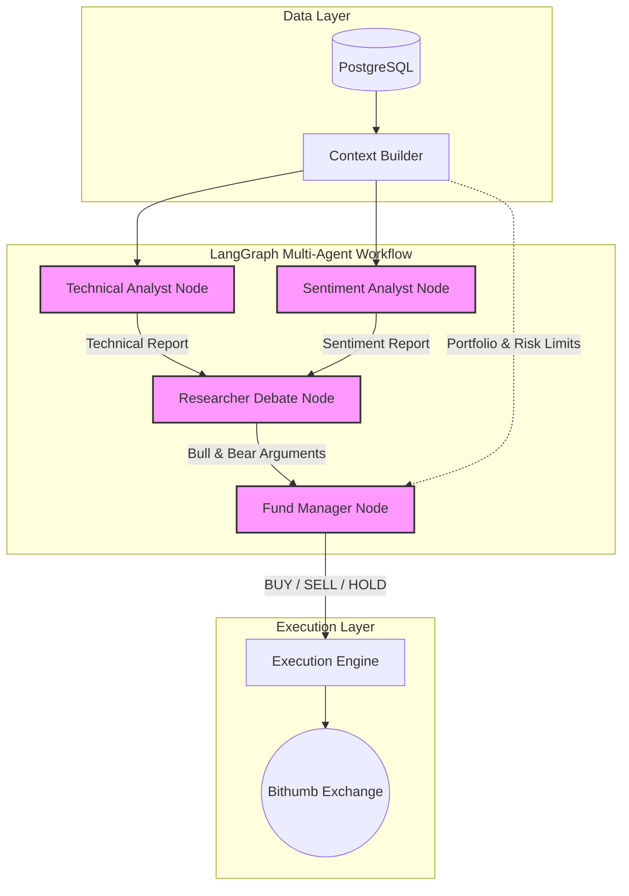

# CoinTrading

Batch-oriented Bitcoin LLM trading system for Bithumb spot trading.

The first implementation runs in paper trading mode by default. It collects market/news context,
computes technical indicators, and forwards them to a **Multi-Agent LangGraph System** for decision making.

## 🤖 Multi-Agent LangGraph Architecture
Instead of relying on a single LLM prompt, this project mimics a real-world investment firm using a multi-agent workflow:
1. **Technical Analyst Agent**: Analyzes OHLCV charts and technical indicators.
2. **Sentiment Analyst Agent**: Analyzes news feeds and market sentiment.
3. **Researcher Debate**: "Bull" and "Bear" agents engage in a rigorous debate on the analyst reports, arguing for and against the trade.
4. **Fund Manager Agent**: The final decision-maker. It reviews the debate, checks the portfolio/risk limits, and issues the final structured `BUY/SELL/HOLD` decision.

This multi-agent approach significantly reduces LLM hallucination, mitigates directional bias, and ensures robust risk management.



The LLM context includes recent compact candles, 30-day and 90-day market summaries, and
multi-timeframe indicators for `1h`, `4h`, and `1d` by default.

## Quick Start

```bash
cp .env.example .env
uv sync --extra dev
uv run coin-trading init-db
uv run coin-trading refresh-data
uv run coin-trading decide-once
uv run streamlit run src/coin_trading/dashboard/app.py
```

## Docker

```bash
cp .env.example .env
docker compose up --build
```

The dashboard runs at `http://localhost:8501`.

## Safety Defaults

- `TRADING_MODE=paper` is the default and no live orders are submitted.
- Live orders require both `TRADING_MODE=live` and `LIVE_TRADING_ENABLED=true`.
- `LIVE_MIN_ORDER_KRW` and `LIVE_MAX_ORDER_KRW` add a final notional guard before submission.
- `EXCHANGE=bithumb_spot` uses Bithumb public market data and can sign private API requests.
- LLM output must pass a typed JSON schema before it can become a trade signal.
- `RiskEngine` can reject signals that exceed position, leverage, or loss limits.
- All decisions, orders, positions, and risk events are stored for later review.

## Batch Operation

Data refresh and trading decisions can run separately.

- `uv run coin-trading refresh-data` collects candles/news and recalculates indicators only.
- `uv run coin-trading decide-once` reads the latest DB context and runs exactly one BUY/SELL/HOLD decision path.
- `uv run coin-trading run-once` keeps the older combined behavior: refresh data, then decide.
- `uv run coin-trading serve-run-once` runs `run-once` every `RUN_ONCE_INTERVAL_MINUTES`, which is the recommended repeated trading batch because it refreshes data before every decision.
- `uv run coin-trading serve` refreshes data on `DATA_REFRESH_INTERVAL_MINUTES` and runs decisions only at `DECISION_TIMES` in `SCHEDULER_TIMEZONE`.
- `uv run coin-trading serve-decisions` runs only `decide-once` every `DECISION_INTERVAL_MINUTES`, useful for LLM rate-limit testing.

Useful scheduling defaults:

```bash
RUN_ONCE_INTERVAL_MINUTES=360
DATA_REFRESH_INTERVAL_MINUTES=240
SCHEDULER_TIMEZONE=Asia/Seoul
DECISION_TIMES=09:00
DECISION_INTERVAL_MINUTES=60
DECISION_COOLDOWN_MINUTES=1440
MAX_DATA_STALENESS_MINUTES=180
```

`decide-once` does not collect fresh market data. If the latest DB candle is older than
`MAX_DATA_STALENESS_MINUTES`, it skips the decision/order path.

For hourly rate-limit tests, set `DECISION_COOLDOWN_MINUTES=60` or `0` before running
`serve-decisions`.

## OpenRouter

OpenRouter can be used through its OpenAI-compatible API. The default example model is
Gemma 4 31B free.

```bash
LLM_PROVIDER=openrouter
LLM_MODEL=google/gemma-4-31b-it:free
OPENROUTER_API_KEY=...
```

## Bithumb API Keys

Put keys in `.env`; do not commit that file.

```bash
BITHUMB_ACCESS_KEY=...
BITHUMB_SECRET_KEY=...
TRADING_MODE=live
PORTFOLIO_SOURCE=exchange
LIVE_TRADING_ENABLED=true
```

Bithumb Private API authentication creates a new JWT per request with `access_key`,
`nonce`, `timestamp`, and a SHA-512 `query_hash` when parameters are present, following
the official docs: [개발 환경 설정하기](https://apidocs.bithumb.com/docs/%EA%B0%9C%EB%B0%9C-%ED%99%98%EA%B2%BD-%EC%84%A4%EC%A0%95%ED%95%98%EA%B8%B0),
[인증 토큰 생성하기](https://apidocs.bithumb.com/docs/%EC%9D%B8%EC%A6%9D-%ED%86%A0%ED%81%B0-%EC%83%9D%EC%84%B1%ED%95%98%EA%B8%B0).

## CLI Commands

### Initialize Database

```bash
uv run coin-trading init-db
```

Creates missing database tables for candles, indicators, LLM decisions, signals, orders,
positions, and risk events. Run this once before the first local execution, and run it
again after model/table changes when using the simple `create_all` flow.

This command does not call Bithumb, does not call an LLM, and never places orders.

### Refresh Data Only

```bash
uv run coin-trading refresh-data
```

Updates market data and analysis inputs only.

It performs:

- Bithumb candle collection for `TIMEFRAME`, `ANALYSIS_TIMEFRAMES`, and `1d`
- backfill until `LOOKBACK_LIMIT` candles exist for each timeframe
- incremental candle updates after the initial backfill
- news RSS collection
- technical indicator calculation into `indicator_snapshots`

It does not create a BUY/SELL/HOLD decision and does not execute paper or live orders.
Use this when you want to keep the DB warm throughout the day.

### Decide Once

```bash
uv run coin-trading decide-once
```

Runs exactly one decision cycle using the latest data already stored in the DB.

It performs:

- latest candle lookup from `market_candles`
- stale-data guard using `MAX_DATA_STALENESS_MINUTES`
- duplicate decision guard using `DECISION_COOLDOWN_MINUTES`
- LLM or mock BUY/SELL/HOLD decision
- `RiskEngine` approval/rejection
- executor step depending on `TRADING_MODE`

It does not refresh candles or indicators before deciding. If the DB data is stale, it
skips the decision/order path. This command is useful for LLM-only tests after a recent
`refresh-data`.

Order behavior:

- `TRADING_MODE=signal_only`: no order record and no live order
- `TRADING_MODE=paper`: simulated order/position only
- `TRADING_MODE=live` plus `LIVE_TRADING_ENABLED=true`: real Bithumb order can be submitted

### Run Once

```bash
uv run coin-trading run-once
```

Runs the full trading batch once.

It performs:

```text
refresh-data
→ decide-once
```

This is the recommended command when the batch is allowed to make a trading decision,
because it refreshes candles, news, and indicators immediately before BUY/SELL/HOLD
judgment.

Order behavior follows the same `TRADING_MODE` rules as `decide-once`.

### Serve Run Once

```bash
uv run coin-trading serve-run-once
```

Runs `run-once` repeatedly every `RUN_ONCE_INTERVAL_MINUTES`.

This is the recommended repeated trading scheduler when you want every decision to use
freshly refreshed data. For example:

```bash
RUN_ONCE_INTERVAL_MINUTES=360  # every 6 hours
```

Be careful with live trading: if `TRADING_MODE=live` and `LIVE_TRADING_ENABLED=true`,
this scheduler can submit real Bithumb orders on each approved cycle.

### Serve Split Jobs

```bash
uv run coin-trading serve
```

Runs two schedules in one process:

- `refresh-data` every `DATA_REFRESH_INTERVAL_MINUTES`
- `decide-once` at each `DECISION_TIMES` value in `SCHEDULER_TIMEZONE`

This mode is useful when you want data refreshes to happen many times per day but trading
decisions to happen only at specific clock times.

Example:

```bash
DATA_REFRESH_INTERVAL_MINUTES=240
SCHEDULER_TIMEZONE=Asia/Seoul
DECISION_TIMES=09:00,21:00
```

### Serve Decisions Only

```bash
uv run coin-trading serve-decisions
```

Runs only `decide-once` every `DECISION_INTERVAL_MINUTES`.

This is mainly for LLM provider testing, such as OpenRouter free-model rate-limit checks.
It does not refresh candles or indicators before each decision, so use it only when the DB
was recently refreshed or when you intentionally want to test LLM calls against the same
context.

For aggressive rate-limit tests:

```bash
DECISION_INTERVAL_MINUTES=10
DECISION_COOLDOWN_MINUTES=0
```

Keep `TRADING_MODE=signal_only` or `TRADING_MODE=paper` while testing provider limits.

### Dashboard

```bash
uv run streamlit run src/coin_trading/dashboard/app.py
```

Starts the Streamlit dashboard. It shows candles, orders, signals, positions, equity,
unrealized PnL, average entry price, position return, position value, and cash available.

The chart uses dashboard-specific candle settings, separate from the trading decision
`TIMEFRAME`. By default it collects and displays 10 days of `10m` candles:

```bash
DASHBOARD_CHART_TIMEFRAME=10m
DASHBOARD_CHART_DAYS=10
```

Use the sidebar to change the chart timeframe, chart day range, and visible sections.

The dashboard does not run trading decisions by itself.

### Tests

```bash
uv run pytest
```

Runs the automated test suite.

### Alembic

```bash
uv run alembic revision --autogenerate -m "describe change"
uv run alembic upgrade head
```

Use these only when you move from simple local table creation to managed database
migrations.

## Command Cheatsheet

```bash
uv run coin-trading init-db
uv run coin-trading run-once
uv run coin-trading refresh-data
uv run coin-trading decide-once
uv run coin-trading serve
uv run coin-trading serve-run-once
uv run coin-trading serve-decisions
uv run alembic revision --autogenerate -m "describe change"
uv run alembic upgrade head
uv run pytest
```
