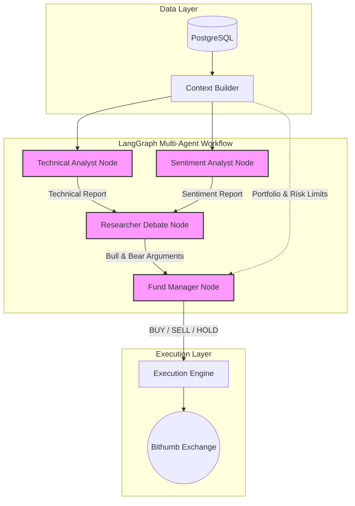

# CoinTrading — LLM 기반 자동 트레이딩 시스템

LLM(대형 언어 모델)이 시장 데이터·기술 지표·뉴스를 종합해 BUY / SELL / HOLD를 결정하고,
리스크 엔진 검증 후 주문을 기록하는 배치형 트레이딩 시스템입니다.

The first implementation runs in paper trading mode by default. It collects market/news context,
computes technical indicators, and forwards them to a **Multi-Agent LangGraph System** for decision making.

## 🤖 Multi-Agent LangGraph Architecture
Instead of relying on a single LLM prompt, this project mimics a real-world investment firm using a multi-agent workflow:
1. **Technical Analyst Agent**: Analyzes OHLCV charts and technical indicators.
2. **Sentiment Analyst Agent**: Analyzes news feeds and market sentiment.
3. **Researcher Debate**: "Bull" and "Bear" agents engage in a rigorous debate on the analyst reports, arguing for and against the trade.
4. **Fund Manager Agent**: The final decision-maker. It reviews the debate, checks the portfolio/risk limits, and issues the final structured `BUY/SELL/HOLD` decision.

This multi-agent approach significantly reduces LLM hallucination, mitigates directional bias, and ensures robust risk management.




## 트레이딩 모드 (3가지)

| # | 모드 | TRADING_MODE | PORTFOLIO_SOURCE | EXCHANGE | 주문 |
|---|---|---|---|---|---|
| ① | **실제 코인** | `live` | `exchange` | `bithumb_spot` | Bithumb 실계좌 |
| ② | **모의 코인** | `paper` | `paper` | `bithumb_spot` | 가상 주문 (기본값) |
| ③ | **모의 주식** | `paper` | `paper` | `yfinance` | 가상 주문 |

> `.env` 상단의 4개 변수만 바꾸면 모드가 전환됩니다. 자세한 내용은 [모드 전환](#모드-전환) 참고.

---

## 빠른 시작

```bash
# 1. 패키지 설치
uv sync --extra dev

# 2. 환경 파일 설정 (처음 한 번만)
cp .env.example .env
# .env 열어서 모드 선택 및 API 키 입력

# 3. DB 초기화 (처음 한 번만)
uv run coin-trading init-db

# 4. 시장 데이터 수집
uv run coin-trading refresh-data

# 5. 한 번 트레이딩 실행 (수집 + 결정)
uv run coin-trading run-once

# 6. 대시보드 실행
uv run streamlit run src/coin_trading/dashboard/app.py
```

---

## 모드 전환

`.env` 파일 상단 4줄만 교체합니다.

### ① 실제 코인 (Bithumb 실계좌)

```bash
TRADING_MODE=live
PORTFOLIO_SOURCE=exchange
EXCHANGE=bithumb_spot
LIVE_TRADING_ENABLED=true
SYMBOL=KRW-BTC
# INITIAL_EQUITY 불필요 — 첫 실행 시 계좌 잔고를 자동으로 기준 자산으로 기록

BITHUMB_ACCESS_KEY=<발급받은 키>
BITHUMB_SECRET_KEY=<발급받은 키>
```

- **첫 실행 시** Bithumb 계좌 잔고(KRW + BTC 평가액)를 기준 자산으로 DB에 자동 저장
- 이후 실행마다 해당 기준점 대비 수익률 계산
- 매수·매도 시 실계좌에 주문 제출
- **`LIVE_TRADING_ENABLED=false`면 주문 차단됨** (안전 장치)
- 주문 한도: `LIVE_MIN_ORDER_KRW` ~ `LIVE_MAX_ORDER_KRW`

> **기준 자산 리셋**: 새로운 시작점을 다시 잡고 싶을 때
> ```bash
> uv run python -c "
> from coin_trading.db.session import SessionLocal
> from coin_trading.db.models import AppState
> s = SessionLocal(); s.query(AppState).filter_by(key='baseline_equity:KRW-BTC').delete(); s.commit()
> print('기준 자산 리셋 완료 — 다음 실행 시 현재 잔고로 재설정됩니다')
> "
> ```

### ② 모의 코인 (Bithumb 시세, 가상 주문) — 기본값

```bash
TRADING_MODE=paper
PORTFOLIO_SOURCE=paper
EXCHANGE=bithumb_spot
LIVE_TRADING_ENABLED=false
SYMBOL=KRW-BTC
INITIAL_EQUITY=10000000   # 가상 초기 자금 (KRW)
```

- Bithumb API로 실제 시세 수집 (계좌 연동 없음)
- 가상 포트폴리오로 P&L 추적
- API 키 없이도 시세 조회 가능

### ③ 모의 주식 (Yahoo Finance, 가상 주문)

```bash
TRADING_MODE=paper
PORTFOLIO_SOURCE=paper
EXCHANGE=yfinance
LIVE_TRADING_ENABLED=false
SYMBOL=AAPL              # US 주식 예시
# SYMBOL=005930.KS       # 삼성전자 예시
INITIAL_EQUITY=10000     # 가상 초기 자금 (USD)

SCHEDULER_TIMEZONE=America/New_York
DECISION_TIMES=09:30,13:00,15:00

NEWS_RSS_URLS=https://feeds.content.dowjones.io/public/rss/mw_topstories,https://finance.yahoo.com/news/rssindex
```

- Yahoo Finance API 키 불필요 (무료)
- 4h 봉은 1h에서 자동 리샘플링
- 한국 주식: `SYMBOL=005930.KS`, `SCHEDULER_TIMEZONE=Asia/Seoul`, `DECISION_TIMES=09:00,11:30,14:00`

---

## 대시보드

```bash
uv run streamlit run src/coin_trading/dashboard/app.py
```

현재 모드와 실시간 계좌 현황을 표시합니다.

### 화면 구성

**상단 배지** — 현재 모드 표시
- 🔴 `실제 코인 [LIVE]`
- 🟢 `모의 코인`
- 🔵 `모의 주식`

**핵심 지표 (1행)**

| 현재 자산 | 총 수익률 | 실현 손익 | 미실현 손익 | 초기 자산 |
|---|---|---|---|---|

- **실제 코인 모드**: 초기 자산 = 첫 실행 시 계좌에서 자동 기록된 기준 자산
- **모의 모드**: 초기 자산 = `INITIAL_EQUITY` 설정값

**포지션 상세 (2행)**

| 보유 수량 | 평균 매수가 | 포지션 수익률 | 사용 가능 현금 |
|---|---|---|---|

**탭 구성**

| 탭 | 내용 |
|---|---|
| **보유 포지션** | 현재 보유 종목, 미실현 손익, 손절/익절가 |
| **매매 기록** | 완료된 거래 내역, 실현 손익, 승률 통계 |
| **신호** | LLM이 생성한 모든 BUY/SELL/HOLD 신호 |
| **주문** | 실제/가상 주문 기록 전체 |

차트: 매수(녹색 ▲) / 매도(적색 ▼) 마커 포함 캔들스틱

---

## CLI 명령어

### `init-db` — DB 초기화

```bash
uv run coin-trading init-db
```

처음 한 번 실행. 캔들·지표·신호·주문·포지션 테이블 생성.

### `refresh-data` — 시장 데이터만 수집

```bash
uv run coin-trading refresh-data
```

캔들 백필, 뉴스 수집, 기술 지표 계산. 주문 없음.

### `decide-once` — 결정 한 번만

```bash
uv run coin-trading decide-once
```

DB에 저장된 최신 데이터로 LLM 결정 + 실행. 데이터 수집 없음.

### `run-once` — 수집 + 결정 1회 (권장)

```bash
uv run coin-trading run-once
```

`refresh-data` → `decide-once` 순서로 1회 실행.

### `serve-run-once` — 반복 스케줄 (권장)

```bash
uv run coin-trading serve-run-once
```

`run-once`를 `RUN_ONCE_INTERVAL_MINUTES` 간격으로 반복 실행.

```bash
RUN_ONCE_INTERVAL_MINUTES=30   # 30분마다 수집 + 결정
```

### `serve` — 수집/결정 별도 스케줄

```bash
uv run coin-trading serve
```

- 데이터 수집: `DATA_REFRESH_INTERVAL_MINUTES` 간격
- 결정: `DECISION_TIMES` 시각에만 실행 (`SCHEDULER_TIMEZONE` 기준)

```bash
DATA_REFRESH_INTERVAL_MINUTES=120
SCHEDULER_TIMEZONE=Asia/Seoul
DECISION_TIMES=09:00,13:00,21:00
```

### `serve-decisions` — 결정 전용 반복

```bash
uv run coin-trading serve-decisions
```

`decide-once`만 `DECISION_INTERVAL_MINUTES` 간격 반복. LLM 테스트용.

---

## 안전 장치

- `TRADING_MODE=paper`가 기본값 — 설정 없이 실주문 불가
- 실주문은 `TRADING_MODE=live` **AND** `LIVE_TRADING_ENABLED=true` 동시에 필요
- `LIVE_MIN_ORDER_KRW` / `LIVE_MAX_ORDER_KRW` — 주문 금액 상하한 강제
- LLM 응답은 JSON 스키마 검증 후 신호로 변환 (실패 시 HOLD 처리)
- `RiskEngine` — 포지션 한도, 레버리지, 일일 손실 한도 초과 시 주문 차단
- 모든 결정·주문·포지션·리스크 이벤트 DB 영구 기록

## 명령어 치트시트

```bash
uv run coin-trading init-db
uv run coin-trading refresh-data
uv run coin-trading decide-once
uv run coin-trading run-once
uv run coin-trading serve
uv run coin-trading serve-run-once
uv run coin-trading serve-decisions
uv run streamlit run src/coin_trading/dashboard/app.py
uv run python -m pytest
uv run alembic revision --autogenerate -m "describe change"
uv run alembic upgrade head
```
