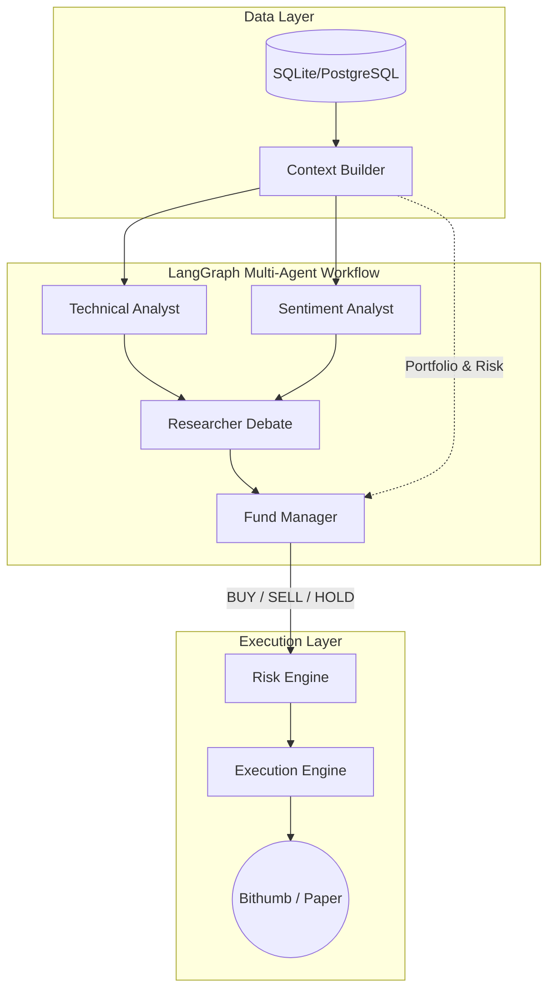

# CoinTrading — LLM 기반 자동 트레이딩 시스템

LLM이 시장 데이터·기술 지표·뉴스를 종합해 BUY / SELL / HOLD를 결정하고,
리스크 엔진 검증 후 주문을 기록하는 트레이딩 시스템입니다.

## 아키텍처

### Multi-Agent LangGraph 의사결정

단일 LLM 프롬프트 대신 실제 투자 회사 구조를 모방한 멀티 에이전트 워크플로:

1. **Technical Analyst** — OHLCV 차트·기술 지표 분석
2. **Sentiment Analyst** — 뉴스 피드·시장 심리 분석
3. **Researcher Debate** — Bull/Bear 에이전트가 논쟁 (방향성 편향 완화)
4. **Fund Manager** — 논쟁 검토 후 포트폴리오·리스크 한도를 확인하여 최종 BUY/SELL/HOLD 결정



### serve-all 실행 구조

`serve-all`은 세 가지 루프를 단일 프로세스에서 동시 실행합니다:

```
┌─────────────────────────────────────────────────────────┐
│                       serve-all                         │
│                                                         │
│  WebSocket TickerMonitor  ──→  실시간 SL/TP 자동 청산    │
│  WebSocket CandleStreamer ──→  실시간 캔들·지표 갱신      │
│  Scheduler (15분 interval) ─→  데이터 수집 + LLM 결정    │
│                                                         │
│  * LLM 결정 중 가격이 0.5% 이상 움직이면 주문 취소        │
└─────────────────────────────────────────────────────────┘
```

---

## 트레이딩 모드

| # | 모드 | TRADING_MODE | PORTFOLIO_SOURCE | EXCHANGE | 주문 |
|---|---|---|---|---|---|
| ① | **실제 코인** | `live` | `exchange` | `bithumb_spot` | Bithumb 실계좌 |
| ② | **모의 코인** | `paper` | `paper` | `bithumb_spot` | 가상 주문 (기본값) |
| ③ | **모의 주식** | `paper` | `paper` | `yfinance` | 가상 주문 |

---

## 빠른 시작

```bash
# 1. 패키지 설치
uv sync --extra dev

# 2. 환경 파일 설정
cp .env.example .env
# .env 열어서 모드 선택 및 API 키 입력

# 3. DB 초기화
uv run coin-trading init-db

# 4. 서비스 시작
uv run coin-trading serve-all
```

---

## 모드 전환

`.env` 파일 상단 블록만 교체합니다.

### ① 실제 코인 (Bithumb 실계좌)

```bash
TRADING_MODE=live
PORTFOLIO_SOURCE=exchange
EXCHANGE=bithumb_spot
LIVE_TRADING_ENABLED=true
SYMBOL=KRW-BTC

BITHUMB_ACCESS_KEY=<발급받은 키>
BITHUMB_SECRET_KEY=<발급받은 키>
```

- 첫 실행 시 계좌 잔고를 기준 자산으로 DB에 자동 저장
- `LIVE_TRADING_ENABLED=false`면 주문 차단 (안전 장치)
- 주문 한도: `LIVE_MIN_ORDER_KRW` ~ `LIVE_MAX_ORDER_KRW`

> **기준 자산 리셋:**
> ```bash
> uv run python -c "
> from coin_trading.db.session import SessionLocal
> from coin_trading.db.models import AppState
> s = SessionLocal()
> s.query(AppState).filter_by(key='baseline_equity:KRW-BTC').delete()
> s.commit()
> print('리셋 완료')
> "
> ```

### ② 모의 코인 (기본값)

```bash
TRADING_MODE=paper
PORTFOLIO_SOURCE=paper
EXCHANGE=bithumb_spot
LIVE_TRADING_ENABLED=false
SYMBOL=KRW-BTC
INITIAL_EQUITY=10000000
```

### ③ 모의 주식 (Yahoo Finance)

```bash
TRADING_MODE=paper
PORTFOLIO_SOURCE=paper
EXCHANGE=yfinance
LIVE_TRADING_ENABLED=false
SYMBOL=AAPL
INITIAL_EQUITY=10000
SCHEDULER_TIMEZONE=America/New_York
```

---

## 대시보드

```bash
uv run streamlit run src/coin_trading/dashboard.py
```

**탭 구성**

| 탭 | 내용 |
|---|---|
| **보유 포지션** | 현재 보유 종목, 미실현 손익, 손절/익절가 |
| **매매 기록** | 완료된 거래, 실현 손익, 승률 통계 |
| **신호** | LLM이 생성한 BUY/SELL/HOLD 신호 전체 |
| **주문** | 실제/가상 주문 기록 |

차트: 매수(녹색 ▲) / 매도(적색 ▼) 마커 포함 캔들스틱

---

## CLI 명령어

| 명령어 | 설명 |
|---|---|
| `init-db` | DB 초기화 (최초 1회) |
| `serve-all` | WebSocket + 스케줄러 통합 서비스 (운영용) |
| `refresh-data` | 시장 데이터 수집만 실행 |
| `decide-once` | DB 데이터 기반 LLM 결정 1회 |
| `run-once` | 수집 + 결정 1회 (디버그용) |

```bash
# 운영
uv run coin-trading init-db
uv run coin-trading serve-all

# 디버그
uv run coin-trading refresh-data
uv run coin-trading decide-once
uv run coin-trading run-once

# 대시보드
uv run streamlit run src/coin_trading/dashboard.py

# 테스트
uv run python -m pytest
```

---

## 안전 장치

- `TRADING_MODE=paper`가 기본값 — 설정 없이 실주문 불가
- 실주문은 `TRADING_MODE=live` **AND** `LIVE_TRADING_ENABLED=true` 동시 필요
- `LIVE_MIN_ORDER_KRW` / `LIVE_MAX_ORDER_KRW` — 주문 금액 상하한 강제
- LLM 응답은 JSON 스키마 검증 후 신호로 변환 (실패 시 HOLD)
- `RiskEngine` — 포지션 한도, 레버리지, 일일 손실 한도 초과 시 주문 차단
- LLM 결정 중 가격 0.5% 이상 이탈 시 주문 취소 (`PRICE_CONSISTENCY_THRESHOLD_PCT`)
- 모든 결정·주문·포지션·리스크 이벤트 DB 영구 기록

---

## 백그라운드 실행 (tmux)

```bash
# 트레이딩 세션 생성 및 서비스 시작
tmux new -s trading
uv run coin-trading serve-all

# 분리 (서비스 유지한 채 터미널 닫기)
Ctrl+B, D

# 재접속
tmux attach -t trading

# 대시보드 별도 창 (같은 세션)
tmux new-window -t trading
uv run streamlit run src/coin_trading/dashboard.py

# 창 전환
Ctrl+B, 0   # 트레이딩
Ctrl+B, 1   # 대시보드
```
